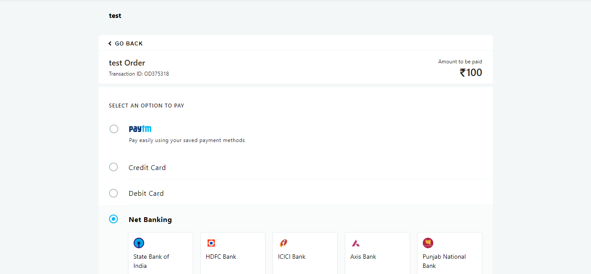

# PayTM-Payment-GateWay
Integrating Paytm Payment Gateway

Firstly, You need to change config file (lib/config_paytm.php)

**define('PAYTM_MERCHANT_KEY', 'Your Merchant Key');
define('PAYTM_MERCHANT_MID', 'Your Merchant ID'); 
define('PAYTM_MERCHANT_WEBSITE', 'Your Website Name');**

